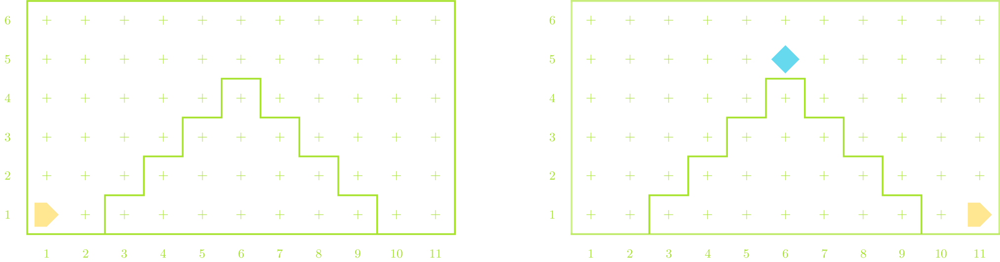

## Problem 1
- Consider the following Karel program:

  ```mypython
  import karel

  def mystery():
      for i in range(4):
          while front_is_clear():
              put_beeper()
              move()
          turn_left()
  ```

:::incremental
- What does this program do in an empty world with Karel beginning facing east in the lower left corner?
- What might be a better name for this function?
- What would be a useful doc-string comment to describe this function?
- Can you use any functions you have already written or seen in class to help decompose this problem?
:::


## Tracing the Mystery Function {data-state='MysteryTrace'}
<table>
<tbody style="border:none;">
<tr>
<td style="vertical-align:top;">
<table>
<tbody style="border:none;">
<tr>
<td>
<div id="MysteryWorld"></div>
</td>
</tr>
<tr>
<td style="text-align:center;">
<table class="CTControlStrip">
<tbody style="border:none;">
<tr>
<td>

</td>
<td>

</td>
<td>

</td>
</tr>
</tbody>
</table>
</td>
</tr>
</tbody>
</table>
</td>
<td style="vertical-align:top;">
<div id="Mystery"></div>
</td>
</tr>
</tbody>
</table>

## A Buggy Reuse of Code {data-state="BuggyPutBeeperBorderTrace"}

<table>
<tbody style="border:none;">
<tr>
<td style="vertical-align:top;">
<table>
<tbody style="border:none;">
<tr>
<td>
<div id="BuggyPutBeeperBorderWorld"></div>
</td>
</tr>
<tr>
<td style="text-align:center;">
<table class="CTControlStrip">
<tbody style="border:none;">
<tr>
<td>

</td>
<td>

</td>
<td>

</td>
<td>

</td>
</tr>
</tbody>
</table>
</td>
</tr>
</tbody>
</table>
</td>
<td style="vertical-align:top;">
<div id="BuggyPutBeeperBorder"></div>
</td>
</tr>
</tbody>
</table>


## Fixing the Bug {data-state='PutBeeperBorderTrace'}

<table>
<tbody style="border:none;">
<tr>
<td style="vertical-align:top;">
<table>
<tbody style="border:none;">
<tr>
<td>
<div id="PutBeeperBorderWorld"></div>
</td>
</tr>
<tr>
<td style="text-align:center;">
<table class="CTControlStrip">
<tbody style="border:none;">
<tr>
<td>

</td>
<td>

</td>
<td>

</td>
<td>

</td>
</tr>
</tbody>
</table>
</td>
</tr>
</tbody>
</table>
</td>
<td style="vertical-align:top;">
<div id="PutBeeperBorder"></div>
</td>
</tr>
</tbody>
</table>

## Problem 2
- Write a program that teaches Karel to climb a "stair-step" mountain of any size, placing a beeper at the top to mark the summit. For example, your program should be able to generate the following before-and-after pictures:

{width=80%}

- If you knew in advance that there were exactly four steps, you could use a `for` statement to repeat the commands needed for each step. In the general case however, you have to figure out how Karel can determine when it reaches the summit and how it can detect that it has reached the ground.

## Breaking the Mountain Down


## Climbing the Mountain {data-state='ClimbMountainTrace'}

<table>
<tbody style="border:none;">
<tr>
<td style="vertical-align:top;">
<table>
<tbody style="border:none;">
<tr>
<td>
<div id="ClimbMountainWorld"></div>
</td>
</tr>
<tr>
<td style="text-align:center;">
<table class="CTControlStrip">
<tbody style="border:none;">
<tr>
<td>

</td>
<td>

</td>
<td>

</td>
<td>

</td>
</tr>
</tbody>
</table>
</td>
</tr>
</tbody>
</table>
</td>
<td style="vertical-align:top;">
<div id="ClimbMountain"></div>
</td>
</tr>
</tbody>
</table>


## Climbing Everest {data-state='ClimbEverestTrace'}

<table>
<tbody style="border:none;">
<tr>
<td style="vertical-align:top;">
<table>
<tbody style="border:none;">
<tr>
<td>
<div id="ClimbEverestWorld"></div>
</td>
</tr>
<tr>
<td style="text-align:center;">
<table class="CTControlStrip">
<tbody style="border:none;">
<tr>
<td>

</td>
<td>

</td>
<td>

</td>
<td>

</td>
</tr>
</tbody>
</table>
</td>
</tr>
</tbody>
</table>
</td>
<td style="vertical-align:top;">
<div id="ClimbEverest"></div>
</td>
</tr>
</tbody>
</table>

